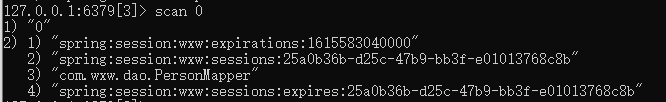

### 缓存问题梳理


### 1. Spring与Redis 缓存

> 常用注解

| 名称           | 解释                                                         |
| -------------- | ------------------------------------------------------------ |
| Cache          | 缓存接口，定义缓存操作。实现有：RedisCache、EhCacheCache、ConcurrentMapCache等 |
| CacheManager   | 缓存管理器，管理各种缓存（cache）组件                        |
| @Cacheable     | 将方法参数结果缓存起来，下一次方法执行参数相同时，将不执行方法，返回缓存中的结果 |
| @CacheEvict    | 清空指定缓存，allEntries：是否清空所有缓存内容，缺省为 false，如果指定为 true |
| @CachePut      | 标记该注解的方法总会执行，根据注解的配置将结果缓存，常用于更新 |
| @EnableCaching | 开启基于注解的缓存，一般放在启动类上                         |
| keyGenerator   | 缓存数据时key生成策略                                        |
| serialize      | 缓存数据时value序列化策略                                    |
| @CacheConfig   | 统一配置本类的缓存注解的属性,，@CacheConfig(cacheNames = "user"),代表该类下的方法均使用这个cacheName |
| @Caching       | 可以指定相同类型的多个缓存注解，例如根据不同的条件           |

> **@Cacheable/@CachePut/@CacheEvict 主要的参数** 

| 名称                           | 解释                                                         |
| ------------------------------ | ------------------------------------------------------------ |
| value                          | 缓存的名称，在 spring 配置文件中定义，必须指定至少一个 例如： @Cacheable(value=”mycache”) 或者 @Cacheable(value={”cache1”,”cache2”} |
| key                            | 缓存的 key，可以为空，如果指定要按照 SpEL 表达式编写， 如果不指定，则缺省按照方法的所有参数进行组合 例如： @Cacheable(value=”testcache”,key=”#id”) |
| condition                      | 缓存的条件，可以为空，使用 SpEL 编写，返回 true 或者 false， 只有为 true 才进行缓存/清除缓存 例如：@Cacheable(value=”testcache”,condition=”#userName.length()>2”) |
| unless                         | 否定缓存。当条件结果为TRUE时，就不会缓存。 @Cacheable(value=”testcache”,unless=”#userName.length()>2”) |
| allEntries (@CacheEvict )      | 是否清空所有缓存内容，缺省为 false，如果指定为 true， 则方法调用后将立即清空所有缓存 例如： @CachEvict(value=”testcache”,allEntries=true) |
| beforeInvocation (@CacheEvict) | 是否在方法执行前就清空，缺省为 false，如果指定为 true， 则在方法还没有执行的时候就清空缓存，缺省情况下，如果方法 执行抛出异常，则不会清空缓存 例如： @CachEvict(value=”testcache”，beforeInvocation=true) |

相关文章

1. [Spring Cache 结合Redis 缓存](http://www.macrozheng.com/#/reference/spring_data_redis) 
2. [史上最全面的Spring-Boot-Cache使用与整合](https://www.cnblogs.com/xiang--liu/p/9720344.html) 

### 2. Spring 与 MyBatis 缓存

MyBatis 内置了一个强大的事务性查询缓存机制，它可以非常方便地配置和定制。默认情况下，只启用了本地的会话缓存，它仅仅对一个会话中的数据进行缓存。


- 官方文档：https://mybatis.org/mybatis-3/zh/sqlmap-xml.html#cache

#### 2.1 缓存的效果

- 映射语句文件中的所有 select 语句的结果将会被缓存。
- 映射语句文件中的所有 insert、update 和 delete 语句会刷新缓存。
- 缓存会使用最近最少使用算法（LRU, Least Recently Used）算法来清除不需要的缓存。
- 缓存不会定时进行刷新（也就是说，没有刷新间隔）。
- 缓存会保存列表或对象（无论查询方法返回哪种）的 1024 个引用。
- 缓存会被视为读/写缓存，这意味着获取到的对象并不是共享的，可以安全地被调用者修改，而不干扰其他调用者或线程所做的潜在修改。

提示：

1.  缓存只作用于 cache 标签所在的映射文件中的语句。如果你混合使用 Java API 和 XML 映射文件，在共用接口中的语句将不会被默认缓存。你需要使用 @CacheNamespaceRef 注解指定缓存作用域。
2. 二级缓存是事务性的。这意味着，当 SqlSession 完成并提交或是完成并回滚但没有执行 flushCache=true 的 insert/delete/update 语句时，缓存会获得更新。

> **缓存执行顺序：** 

如果你的MyBatis使用了二级缓存，并且你的Mapper和select语句也配置使用了二级缓存，那么在执行select查询的时候，MyBatis会先从二级缓存中取输入，其次才是一级缓存，即MyBatis查询数据的顺序是：

　　二级缓存    ———> 一级缓存——> 数据库 

#### 2.2 缓存原理

缓存机制可以减轻数据库压力，提高数据库性能，mybatis的缓存分为两级：一级缓存、二级缓存

- **一级缓存** 

一级缓存为 `sqlsesson` 缓存，缓存的数据只在 SqlSession 内有效。在操作数据库的时候需要先创建 SqlSession 会话对象，在对象中有一个 HashMap 用于存储缓存数据，此 HashMap 是当前会话对象私有的，别的 SqlSession 会话对象无法访问。

具体流程：

- 第一次执行 select 完毕会将查到的数据写入 SqlSession 内的 HashMap 中缓存起来

- 第二次执行 select 会从缓存中查数据，如果 select 同传参数一样，那么就能从缓存中返回数据，不用去数据库了，从而提高了效率

**注意：** 

1. 如果 SqlSession 执行了 DML 操作（insert、update、delete），并 commit 了，那么 mybatis 就会清空当前 SqlSession 缓存中的所有缓存数据，这样可以保证缓存中的存的数据永远和数据库中一致，避免出现差异

2. 当一个 SqlSession 结束后那么他里面的一级缓存也就不存在了， mybatis 默认是开启一级缓存，不需要配置

3. mybatis 的缓存是基于 [namespace:sql语句:参数] 来进行缓存的，意思就是， SqlSession 的 HashMap 存储缓存数据时，是使用 [namespace:sql:参数] 作为 key ，查询返回的语句作为 value 保存的

4. Spring与MyBatis整合时，MyBatis的一级缓存在没有事务存在的时候失效。

   ```
   在未开启事务的情况之下，每次查询，spring都会关闭旧的sqlSession而创建新的sqlSession,因此此时的一级缓存是没有启作用的;
   在开启事务的情况之下，spring使用threadLocal获取当前资源绑定同一个sqlSession，因此此时一级缓存是有效的。
   ```

- **二级缓存** 

二级缓存是` mapper` 级别的缓存，也就是同一个 namespace 的 mapper.xml ，当多个 SqlSession 使用同一个 Mapper 操作数据库的时候，得到的数据会缓存在同一个二级缓存区域

二级缓存默认是没有开启的。需要在 setting 全局参数中配置开启二级缓存

开启二级缓存步骤：

1. `conf.xml` 配置全局变量开启二级缓存

```xml
<settings>
    <setting name="cacheEnabled" value="true"/>默认是false：关闭二级缓存
<settings>
```

2. 在` userMapper.xml `中配置

```xml
<cache eviction="LRU" flushInterval="60000" size="512" readOnly="true"/>当前mapper下所有语句开启二级缓存
```

这里配置了一个 LRU 缓存，并每隔60秒刷新，最大存储512个对象，而返回的对象是只读的

若想禁用当前`select`语句的二级缓存，添加 `useCache="false"`修改如下：

```xml
<select id="getCountByName" 
        parameterType="java.util.Map" 
        resultType="INTEGER" 
        statementType="CALLABLE"         
        useCache="false" // 为false时，禁用二级缓存，在下一查询时会刷新后从数据库重新查询数据
 >
```

具体流程：

1. 当一个` sqlseesion `执行了一次` select` 后，在关闭此` session` 的时候，会将查询结果缓存到二级缓存（比如redis中）
2. 当另一个` sqlsession `执行` select` 时，首先会在他自己的一级缓存中找，如果没找到，就回去二级缓存中找，找到了就返回，就不用去数据库了，从而减少了数据库压力，提高了并发性能

**注意:** 

1. 如果 `SqlSession` 执行了 DML 操作`（insert、update、delete）`，并 `commit` 了，那么 `mybatis` 就会清空当前` mapper` 缓存中的所有缓存数据，这样可以保证缓存中存的数据永远和数据库中一致，避免出现差异
2. ` mybatis` 的缓存是基于` [namespace:sql语句:参数] `来进行缓存的，意思就是，`SqlSession` 的 `HashMap` 存储缓存数据时，是使用 `[namespace:sql:参数] `作为 `key` ，查询返回的语句作为 `value` 保存的。

- **useCache和flushCache** 

mybatis中还可以配置userCache和flushCache等配置项，userCache是用来设置是否禁用二级缓存的，在statement中设置useCache=false可以禁用当前select语句的二级缓存，即每次查询都会发出sql去查询，默认情况是true，即该sql使用二级缓存。

```
<select id="selectUserByUserId" useCache="false" resultType="com.ys.twocache.User" parameterType="int">    
        select * from user where id=#{id}
</select>
```

这种情况是针对每次查询都需要最新的数据sql，要设置成useCache=false，禁用二级缓存，直接从数据库中获取。

在mapper的同一个namespace中，如果有其它insert、update、delete操作数据后需要刷新缓存，如果不执行刷新缓存会出现脏读。

设置statement配置中的flushCache=”true” 属性，默认情况下为true，即刷新缓存，如果改成false则不会刷新。使用缓存时如果手动修改数据库表中的查询数据会出现脏读。

```
<select id="selectUserByUserId" flushCache="true" useCache="false" resultType="com.ys.twocache.User"    parameterType="int">    
     select * from user where id=#{id} 
</select>
```

一般下执行完commit操作都需要刷新缓存，flushCache=true表示刷新缓存，这样可以避免数据库脏读。所以我们不用设置，默认即可。

> **关于sqlSessionFactory 和二级缓存的关系**  

- sqlSessionFactory 也就是二级缓存，如果SqlSession对象没有close()或commit(),则不会把缓存数据刷到SqlSessionFactory中 
- **有效范围** ：同一个factory 内，SqlSession 可以共享
- **什么时候使用二级缓存：** 当数据被频繁使用查询，而且很少被修改
- 使用注意步骤：
  - 在mapper.xml中配置标签：` <cache />` 
  - 如果标签中不写readOnly="true",则对应的实体需要序列化
- 当SqlSession 对象执行 close()或commit() 方法时，会把SqlSession缓存刷新到 SqlSessionFactory缓存区中


#### 2.3 二级缓存实现源码

**整体概况:** 

 

**基本缓存实现：PerpetualCache源码** 

```java
package org.apache.ibatis.cache.impl;

import java.util.HashMap;
import java.util.Map;
import org.apache.ibatis.cache.Cache;
import org.apache.ibatis.cache.CacheException;

public class PerpetualCache implements Cache {
    private final String id;
    private final Map<Object, Object> cache = new HashMap(); // 线程不安全

    public PerpetualCache(String id) {
        this.id = id;
    }

    public String getId() {
        return this.id;
    }

    public int getSize() {
        return this.cache.size();
    }

    public void putObject(Object key, Object value) {
        this.cache.put(key, value);
    }

    public Object getObject(Object key) {
        return this.cache.get(key);
    }

    public Object removeObject(Object key) {
        return this.cache.remove(key);
    }

    public void clear() {
        this.cache.clear();
    }

    public boolean equals(Object o) {
        if (this.getId() == null) {
            throw new CacheException("Cache instances require an ID.");
        } else if (this == o) {
            return true;
        } else if (!(o instanceof Cache)) {
            return false;
        } else {
            Cache otherCache = (Cache)o;
            return this.getId().equals(otherCache.getId());
        }
    }

    public int hashCode() {
        if (this.getId() == null) {
            throw new CacheException("Cache instances require an ID.");
        } else {
            return this.getId().hashCode();
        }
    }
}
```

- 那么既然他都已经有一个实现了, 我们为什么还要自定义实现呢?

原因很简单, 默认实现是(HashMap) 本地缓存, 不支持分布式缓存, 而我们现在大多数项目都是以集群的方式部署, 这种情况下, 使用本地缓存会出现很严重的脏读问题, 特定情况下更新可直接导致数据不一致的问题.

如果让缓存实现支持分布式呢? 方案有很多, 基本围绕着NoSQL数据库实现, 最常用的就是Redis了, 接下来我们就来用Redis实现自定义缓存类

#### 2.4 自定义二级缓存

在MyBatis中，默认的二级缓存Cache实现是PerpetualCache，而通常，这种方式满足不了分布式集群的项目，这时候，我们可以借助一些第三方服务来做缓存，比如Redis，下面，来尝试下用Redis做MyBatis的二级缓存

```java
public class Mybatis2RedisCached implements Cache {

    protected final Logger logger = LoggerFactory.getLogger(getClass());

    private final ReadWriteLock readWriteLock = new ReentrantReadWriteLock(true);

    private static RedisTemplate<Object, Object> redisTemplate;

    public static void setRedisTemplate(RedisTemplate<Object, Object> redisTemplate) {
        Mybatis2RedisCached.redisTemplate = redisTemplate;
    }

    private String keyId;

    public Mybatis2RedisCached(final String keyId) {
        if (keyId == null) {
            throw new IllegalArgumentException("Cache instances require an ID");
        }
        logger.info("Redis Cache keyId " + keyId);
        this.keyId = keyId;
    }

    @Override
    public String getId() {
        return this.keyId;
    }

    @Override
    public void putObject(Object key, Object value) {
        if (value != null) {
            redisTemplate.opsForHash().put(this.keyId, key.toString(), value);
        }
    }

    @Override
    public Object getObject(Object key) {
        if (key != null) {
            return redisTemplate.opsForHash().get(this.keyId, key.toString());
        }
        return null;
    }

    @Override
    public Object removeObject(Object key) {
        if (key != null) {
            return redisTemplate.opsForHash().delete(this.keyId, key.toString());
        }
        return null;
    }

    @Override
    public void clear() {
        redisTemplate.delete(this.keyId);
    }

    @Override
    public int getSize() {
        return redisTemplate.opsForHash().size(this.keyId).intValue();
    }

    @Override
    public ReadWriteLock getReadWriteLock() {
        return this.readWriteLock;
    }
}

```

#### 2.5 常见问题

1. **是否需要给二级缓存 设置一个过期时间?（自定义缓存中flushInterval无效） ** 
   - https://zhuanlan.zhihu.com/p/92817615

相关文章

1. [两种方式（xml+代码）构建SqlSessionFactory+完整实现](https://www.cnblogs.com/weibanggang/p/10117596.html) 
2. [MyBatis二级缓存原理详解](https://www.cnblogs.com/alimayun/p/10952543.html)  
3. [聊聊MyBatis缓存机制-美团](https://tech.meituan.com/2018/01/19/mybatis-cache.html)   

### 3. SpringBoot 与 Session 缓存

在传统的单服务架构中，一般来说，只有一个服务器，那么不存在 Session 共享问题，但是在分布式/集群项目中，Session 共享则是一个必须面对的问题，先看一个简单的架构图：

 

在这样的架构中，会出现一些单服务中不存在的问题，例如客户端发起一个请求，这个请求到达 Nginx 上之后，被 Nginx 转发到 Tomcat A 上，然后在 Tomcat A 上往 session 中保存了一份数据，下次又来一个请求，这个请求被转发到 Tomcat B 上，此时再去 Session 中获取数据，发现没有之前的数据。对于这一类问题的解决，思路很简单，就是将各个服务之间需要共享的数据，保存到一个公共的地方（主流方案就是 **Redis**）：

 

当所有 Tomcat 需要往 Session 中写数据时，都往 Redis 中写，当所有 Tomcat 需要读数据时，都从 Redis 中读。这样，不同的服务就可以使用相同的 Session 数据了。

这样的方案，可以由开发者手动实现，即手动往 Redis 中存储数据，手动从 Redis 中读取数据，相当于使用一些 Redis 客户端工具来实现这样的功能，毫无疑问，手动实现工作量还是蛮大的。

一个简化的方案就是使用 Spring Session 来实现这一功能，Spring Session 就是使用 Spring 中的代理过滤器，将所有的 Session 操作拦截下来，自动的将数据 同步到 Redis 中，或者自动的从 Redis 中读取数据。

**对于开发者来说，所有关于 Session 同步的操作都是透明的，开发者使用 Spring Session，一旦配置完成后，具体的用法就像使用一个普通的 Session 一样。** 

此时关于 session 共享的配置就已经全部完成了，session 共享的效果我们已经看到了，但是每次访问都是我自己手动切换服务实例，因此，接下来我们来引入 Nginx ，实现服务实例自动切换。

#### 3.1 Nginx 实例配置

```conf
	upstream mysession{
	  server localhost:8080 weight=1;
	  server localhost:8081 weight=2;
	}
    server {
        listen       8000;
        server_name  localhost;

        #charset koi8-r;

        #access_log  logs/host.access.log  main;

        location / {
            root   html;
            index  index.html index.htm;
			proxy_pass http://mysession;
        }
     }
```

**测试链接** 

- ` http://localhost:8000/session/set`   根据权重返回对应的端口：` 8080 8081` 
- ` http://localhost:8000/session/get`  根据Nginx权重分流到不同的tomcat ：返回：` Java半颗糖:8081` 、` Java半颗糖:8080` 

通时,redis也会对应的缓存K-V 键值对：

 

相关文章

1. [分布式环境不同 服务器 之间 session 共享问题](https://www.cnblogs.com/ljstudy/p/14457026.html) 
2. 源码参见地址：https://github.com/GitHubWxw/wxw-concurrent 

### 4.  本地缓存