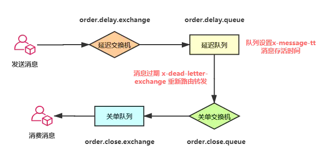
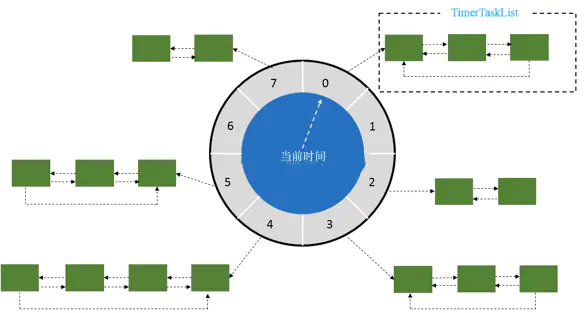
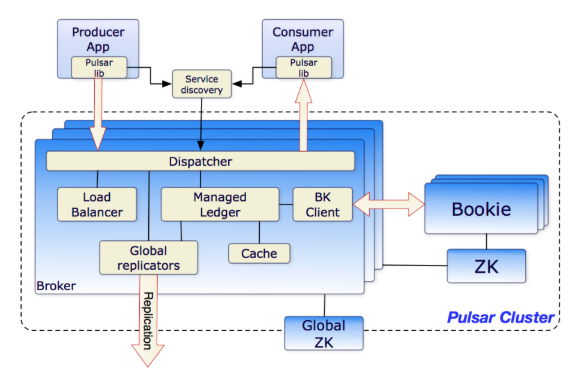

## 如何实现延时队列

### 一、延时队列的应用

#### 1.1 什么是延时队列？

顾名思义：首先它要具有队列的特性，再给它附加一个延迟消费队列消息的功能，也就是说可以指定队列中的消息在哪个时间点被消费。

延时队列在项目中的应用还是比较多的，尤其像电商类平台：

1. 下订单成功后，在30分钟内没有支付，自动取消订单
2. 外卖平台发送订餐通知，下单成功后60s给用户推送短信。
3. 如果订单一直处于某一个未完结状态时，及时处理关单，并退还库存
4. 淘宝新建商户一个月内还没上传商品信息，将冻结商铺等
5. 用户登录之后5分钟给用户做分类推送；
6. 用户多少天未登录给用户做召回推送；
7. 关闭空闲连接。服务器中，有很多客户端的连接，空闲一段时间之后需要关闭之。
8. 清理过期数据业务上。比如缓存中的对象，超过了空闲时间，需要从缓存中移出。
9. 任务超时处理。在网络协议滑动窗口请求应答式交互时，处理超时未响应的请求。
10. 新创建店铺，N天内没有上传商品，系统如何知道该信息，并发送激活短信？

####  1.2 延迟队列和定时任务的区别

- 定时任务有明确的触发时间，延时任务没有
- 定时任务有执行周期，而延时任务在某事件触发后一段时间内执行，没有执行周期
- 定时任务一般执行的是批处理操作是多个任务，而延时任务一般是单个任务

业界目前也有很多实现方案，单机版的方案就不说了，现在也没有哪个公司还是单机版的服务，今天我们一一探讨各种方案的大致实现。

### 二、延时队列的实现

个人一直秉承的观点：工作上能用`JDK`自带`API`实现的功能，就不要轻易自己重复造轮子，或者引入三方中间件。一方面自己封装很容易出问题（大佬除外），再加上调试验证产生许多不必要的工作量；另一方面一旦接入三方的中间件就会让系统复杂度成倍的增加，维护成本也大大的增加。 

#### 2.1 定时轮询（quartz,数据库等）

> 通过一个线程定时的去扫描数据库，通过下订单时间来判断是否有超时的订单，然后进行update或delete等操作

对于未支付的订单，需要进行定期扫描，判断其产生时间有没有超过固定的时间，如果超过则取消订单。这样做很不好，因为：

1. 扫描数据库，每次扫描整个表非常耗时，因为一直在阻塞，很耗费资源
2. 所谓的定期扫描，扫描时间的粒度太小，就会造成资源浪费，扫描的粒度太大就会造成订单没有及时删除

##### **（1）实现** 

> 基于主流的定时任务,定时扫描：

常见的定时任务主要有：quartz、xxl-job、spring系列的task、linux自带的 corntab和加工后的 JcronTab等

下面为方便起见,使用spring task实现主要思路

```java
public class JobDelayQueueDemo {
    
    // 下单时间
    Date submitOrder = null;

    // 取消订单时间：下单30分钟后 检测如果未支付，则自动取消订单，生成订单60s后，给客户发短信
    Date executeTime = null;

    /**
     * Step2: 定时扫描数据库
     *
     * 每隔五秒
     */
    @Scheduled(cron = "0/5 * * * * ? ")
    public void process(){

        System.out.println("我是定时任务！\n 我来看一下延迟时间够了没有！！" );
        /**
         * 检测当前时间 是否是取消订单时间
         * 当前时间 - 执行时间 如果误差小于 2s则取消订单
         */
        if (System.currentTimeMillis() - executeTime.getTime() < 2000) {
            System.out.println("取消订单逻辑处理");
            /**
             * 取消订单逻辑
             * 此处省略1000万行代码
             */
            System.out.println("发送短信提醒客户，订单已取消");
        }

    }

    /**
     * Step1: 提交订单，存入数据库
     */
    public void submitOrder(){
        /**
         * 下单时间，如果当前时间超过下单时间30分钟未支付 则发送短信提醒将自动取消订单
         */
        submitOrder = DateTools.string2DateTime("2020-07-22 13:00:00");

        /**
         *  取消订单时间：下单30分钟后 检测如果未支付，则自动取消订单，生成订单60s后，给客户发短信
         */
        executeTime = DateUtils.addMinutes(submitOrder,30);

        /**
         * 存入数据库
         * 此处省略 100000万行代码
         */
    }
}
```

下面为方便起见,使用spring quartz 实现主要思路:

```java
public class QuartzDelayQueueDemo implements Job {

    // 下单时间
    Date submitOrder = null;

    // 取消订单时间：下单30分钟后 检测如果未支付，则自动取消订单，生成订单60s后，给客户发短信
    Date executeTime = null;

    public static void main(String[] args) throws SchedulerException {
        // 创建任务
        JobDetail jobDetail = JobBuilder.newJob(QuartzDelayQueueDemo.class)
                .withIdentity("job1", "group1").build();
        // 创建触发器 每3秒钟执行一次
        Trigger trigger = TriggerBuilder
                .newTrigger()
                .withIdentity("trigger1", "group3")
                .withSchedule(
                        SimpleScheduleBuilder.simpleSchedule()
                                .withIntervalInSeconds(3).repeatForever())
                .build();
        Scheduler scheduler = new StdSchedulerFactory().getScheduler();
        // 将任务及其触发器放入调度器
        scheduler.scheduleJob(jobDetail, trigger);
        // 调度器开始调度任务
        scheduler.start();

    }

    @Override
    public void execute(JobExecutionContext jobExecutionContext) throws JobExecutionException {
        System.out.println("我是定时任务！\n 我来看一下延迟时间够了没有！！");
        /**
         * 检测当前时间 是否是取消订单时间
         * 当前时间 - 执行时间 如果误差小于 2s则取消订单
         */
        if (System.currentTimeMillis() - executeTime.getTime() < 2000) {
            System.out.println("取消订单逻辑处理");
            /**
             * 取消订单逻辑
             * 此处省略1000万行代码
             */
            System.out.println("发送短信提醒客户，订单已取消");
        }
    }
}
```

**源码地址：** [快速访问](https://github.com/GitHubWxw/wxw-concurrent/tree/master/cloud-delayqueue/src/main/java/com/wxw/common/job_delay_queue) 

##### （2）优缺点

**优点** ：简单易行，支持集群操作
**缺点** ：

- 对服务器内存消耗大
- 存在延迟，比如你每隔3分钟扫描一次，那最坏的延迟时间就是3分钟
- 假设你的订单有几千万条，每隔几分钟这样扫描一次，数据库损耗极大
- 数据量过大时会消耗太多的IO资源，效率太低

#### 2.2 DelayQueue 延时队列（JDK）

`JDK` 中提供了一组实现延迟队列的`API`，位于`Java.util.concurrent`包下`DelayQueue`。

`DelayQueue`是一个`BlockingQueue`（无界阻塞）队列，它本质就是封装了一个`PriorityQueue`（优先队列），`PriorityQueue`内部使用`完全二叉堆`（不知道的自行了解哈）来实现队列元素排序，我们在向`DelayQueue`队列中添加元素时，会给元素一个`Delay`（延迟时间）作为排序条件，队列中最小的元素会优先放在队首。队列中的元素只有到了`Delay`时间才允许从队列中取出。队列中可以放基本数据类型或自定义实体类，在存放基本数据类型时，优先队列中元素默认升序排列，自定义实体类就需要我们根据类属性值比较计算了。

先简单实现一下看看效果，添加三个`order`入队`DelayQueue`，分别设置订单在当前时间的`5秒`、`10秒`、`15秒`后取消。

 

要实现`DelayQueue`延时队列，队中元素要`implements` `Delayed` 接口，这个接口里只有一个`getDelay`方法，用于设置延期时间。`Order`类中`compareTo`方法负责对队列中的元素进行排序。

其中：

- poll()：获取并移除队列的超时元素，没有则返回空 
- take()：获取并移除队列的超时元素，如果没有则wait当前线程，直到有元素满足超时条件，返回结果。

##### **（1）实现** 

1. BlockingQueue+PriorityQueue（堆排序）+Delayed
2. DelayQueue中存放的对象需要实现compareTo()方法和getDelay()方法
3. getDelay方法返回该元素距离失效还剩余的时间，当<=0时元素就失效了，就可以从队列中获取到

```java
public class DelayOrder implements Delayed {

    /**
     * 延迟时间
     */
    @JsonFormat(locale = "zh", timezone = "GMT+8", pattern = "yyyy-MM-dd HH:mm:ss")
    private long time;

    /**
     * 订单号
     */
    String orderNumber = null;

    public DelayOrder(String orderNumber, long time, TimeUnit unit) {
        this.orderNumber = orderNumber;
        this.time = System.currentTimeMillis() + (time > 0 ? unit.toMillis(time) : 0);
    }

    /**
     * 返回距离你自定义的超时时间还有多少
     * @param unit
     * @return
     */
    @Override
    public long getDelay(TimeUnit unit) {
        return time - System.currentTimeMillis();
    }

    /**
     * https://www.runoob.com/java/java-string-compareto.html
     * @param o
     * @return
     */
    @Override
    public int compareTo(Delayed o) {
        DelayOrder Order = (DelayOrder) o;
        long diff = this.time - Order.time;
        if (diff <= 0) {
            return -1;
        } else {
            return 1;
        }
    }

    void print() {
        System.out.println(orderNumber + "编号的订单准备删除，删除时间："
                + DateTools.getLong2YyyyMmDdHhMmSs(System.currentTimeMillis()));
    }

}
```

`DelayQueue`的`put`方法是线程安全的，因为`put`方法内部使用了`ReentrantLock`锁进行线程同步。

 `DelayQueue`还提供了两种出队的方法 `poll()` 和 `take()` 

-  `poll()` 为非阻塞获取，没有到期的元素直接返回null；
-  `take()` 阻塞方式获取，没有到期的元素线程将会等待。

```java
public class DelayQueueDemo {

    public static void main(String[] args) throws InterruptedException {
        DelayOrder orderNumber1 = new DelayOrder("orderNumber1", 5, TimeUnit.SECONDS);
        DelayOrder orderNumber2 = new DelayOrder("orderNumber2", 10, TimeUnit.SECONDS);
        DelayOrder orderNumber3 = new DelayOrder("orderNumber3", 15, TimeUnit.SECONDS);
        DelayQueue<DelayOrder> delayOrders = new DelayQueue<>();
        delayOrders.put(orderNumber1);
        delayOrders.put(orderNumber2);
        delayOrders.put(orderNumber3);
        System.out.println("订单延迟队列开始时间:" + 
                           LocalDateTime.now().format(DateTimeFormatter.ofPattern("yyyy-MM-dd HH:mm:ss")));
        while (delayOrders.size() != 0){
            /**
             * 取队列头部元素是否过去
             * poll()：获取并移除队列的超时元素，没有则返回空
             * take()：获取并移除队列的超时元素，如果没有则wait当前线程，直到有元素满足超时条件，返回结果。
             */
//             DelayOrder task = delayOrders.poll();
            DelayOrder task1 = delayOrders.take();
            if (task1 != null) {
                System.out.format("订单:{%s}被取消, 取消时间:{%s}\n", task1.orderNumber, 
                                  LocalDateTime.now().format(DateTimeFormatter.ofPattern("yyyy-MM-dd HH:mm:ss")));
            }
//            Thread.sleep(1000);
        }
    }
}
```

上边只是简单的实现入队与出队的操作，实际开发中会有专门的线程，负责消息的入队与消费。

执行后看到结果如下，`Order1`、`Order2`、`Order3` 分别在 `5秒`、`10秒`、`15秒`后被执行，至此就用`DelayQueue`实现了延时队列。

```java
订单延迟队列开始时间:2020-12-14 13:20:48
订单:{orderNumber1}被取消, 取消时间:{2020-12-14 13:20:53}
订单:{orderNumber2}被取消, 取消时间:{2020-12-14 13:20:58}
订单:{orderNumber3}被取消, 取消时间:{2020-12-14 13:21:03}
```

##### （2）优缺点

**优点** ：效率高,任务触发时间延迟低

**缺点**：

1. 服务器重启后，数据全部消失，怕宕机
2. 集群扩展相当麻烦
3. 因为内存条件限制的原因，比如下单未付款的订单数太多，那么很容易就出现OOM异常
4. 代码复杂度较高，分布式需要额外实现（无法指定绝对的日期或时间）

#### 2.3 ScheduledExecutorService(JDk 线程池)

**JUC** 提供了相关的类以支持对 **延时任务** 和 **周期任务** 的支持，功能类似于 java.util.Timer，但官方推荐使用功能更为强大全面的 
ScheduledThreadPoolExecutor，因为后者支持多任务作业，即线程池；

##### **（1）实现** 

```java
public void ScheduledExecutorServiceTest() throws InterruptedException {

        ScheduledExecutorService scheduledExecutorService = Executors.newScheduledThreadPool(5);

        System.out.println("创建5秒延迟的任务,时间："+ DateTools.getLong2YyyyMmDdHhMmSs(System.currentTimeMillis()));
        ScheduledFuture<?> schedule = scheduledExecutorService.schedule(() -> doTask("5s"), 5, TimeUnit.SECONDS);

        Thread.sleep(4900);

        schedule.cancel(false);
        System.err.println("取消5秒延迟的任务，时间：" + DateTools.getLong2YyyyMmDdHhMmSs(System.currentTimeMillis()));

        System.out.println("创建3秒延迟的任务，时间" + DateTools.getLong2YyyyMmDdHhMmSs(System.currentTimeMillis()));
        ScheduledFuture<?> schedule2 = scheduledExecutorService.schedule(new Runnable() {
            @Override
            public void run() {
                doTask("3s");
            }
        }, 3, TimeUnit.SECONDS);

        Thread.sleep(4000);

    }
```

执行结果：

```scss
创建5秒延迟的任务,时间：2020-12-14 13:49:17
取消5秒延迟的任务，时间：2020-12-14 13:49:22
创建3秒延迟的任务，时间2020-12-14 13:49:22
3s 任务执行，时间： 2020-12-14 13:49:25
```

#### 2.4 Timer与TimerTask（JDK）

 

- TaskQueue中的排序是对TimerTask中的下一次执行时间进行堆排序，每次去取数组第一个。
- 而delayQueue是对queue中的元素的getDelay()结果进行排序

*Timer是一种定时器工具，用来在一个后台线程计划执行指定任务。它可以计划执行一个任务一次或反复多次。 主要方法：* 

  

##### （1）实现

```java
public class TimerDemo {
    public static void main(String[] args) {
        Timer timer = new Timer();// 实例化Timer类
        timer.schedule(new TimerTask() {
            public void run() {
                System.out.println("退出，时间："+ DateTools.getLong2YyyyMmDdHhMmSs(System.currentTimeMillis()));
                this.cancel();
            }
        }, 5000); // 5s
        System.out.println("本程序存在5秒后自动退出,时间："+ DateTools.getLong2YyyyMmDdHhMmSs(System.currentTimeMillis()));

    }
}
```

##### （2）优缺点

**缺点：** 

- Timers没有持久化机制.
- Timers不灵活 (只可以设置开始时间和重复间隔，不是基于时间、日期、天等（秒、分、时）的)
- Timers 不能利用线程池，一个timer一个线程
- Timers没有真正的管理计划

##### （3）任务对比

 

还有： DelayQueue 延时队列（JDK）,无法指定绝对的日期或时间，无法高可用（节点挂了任务不能跑）

#### 2.5 Redis 延迟队列

Redis 实现延迟队列有两种方式：

1. **Redis sorted set** 
2. **Redis 过期回调** 

##### （1）Redis sorted set

`Redis`的数据结构`Zset`，同样可以实现延迟队列的效果，主要利用它的`score`属性，`redis`通过`score`来为集合中的成员进行从小到大的排序。

 

通过`zadd`命令向队列`delayqueue` 中添加元素，并设置`score`值表示元素过期的时间；

向`delayqueue` 添加三个`order1`、`order2`、`order3`，分别是`10秒`、`20秒`、`30秒`后过期。

```bash
 zadd delayqueue 3 order3
```

消费端轮询队列`delayqueue`， 将元素排序后取最小时间与当前时间比对，如小于当前时间代表已经过期移除`key`。

```java
public class RedisZsetDelayQueue {

    private static String DELAY_QUEUE = "delay_queue";

    public static void main(String[] args) {

        RedisZsetDelayQueue redisDelay = new RedisZsetDelayQueue();
        redisDelay.pushOrderQueue();
        redisDelay.pollOrderQueue();
        redisDelay.deleteZSet();
    }

    /**
     * 消息入队
     */
    public void pushOrderQueue() {
        Jedis jedis = JedisClient.JedisClient();
        Calendar cal1 = Calendar.getInstance();
        cal1.add(Calendar.SECOND, 10);
        int order1 = (int) (cal1.getTimeInMillis() / 1000); // 10s 后的时间戳

        Calendar cal2 = Calendar.getInstance();
        cal2.add(Calendar.SECOND, 20);
        int order2 = (int) (cal2.getTimeInMillis() / 1000);

        Calendar cal3 = Calendar.getInstance();
        cal3.add(Calendar.SECOND, 30);
        int order3 = (int) (cal3.getTimeInMillis() / 1000);

        /**
         * String key, double score, String member
         * key = DELAY_QUEUE
         * order1 = 权重
         * member = order1
         */
        jedis.zadd(DELAY_QUEUE, order1, "order1");
        jedis.zadd(DELAY_QUEUE, order2, "order2");
        jedis.zadd(DELAY_QUEUE, order3, "order3");
        System.out.println(DateTools.getLong2YyyyMmDdHhMmSs(System.currentTimeMillis()) + " add finished.");
    }

    /**
     * 删除队列
     */
    public void deleteZSet() {
        Jedis jedis = JedisClient.JedisClient();
        jedis.del(DELAY_QUEUE);
    }

    /**
     * 消费消息
     */
    public void pollOrderQueue() {

        Jedis jedis = JedisClient.JedisClient();
        while (true) {
            Set<Tuple> set = jedis.zrangeWithScores(DELAY_QUEUE, 0, 0);
            String value = ((Tuple) set.toArray()[0]).getElement();
            int score = (int) ((Tuple) set.toArray()[0]).getScore();

            Calendar cal = Calendar.getInstance();
            int nowSecond = (int) (cal.getTimeInMillis() / 1000);

            if (nowSecond >= score) {
                // 移除有序集合中的一个或多个成员
                jedis.zrem(DELAY_QUEUE, value);
                System.out.println(DateTools.getLong2YyyyMmDdHhMmSs(System.currentTimeMillis()) + 
                                   " removed key:" + value);
            }
            // 获取有序集合的成员数
            if (jedis.zcard(DELAY_QUEUE) <= 0) {
                System.out.println(DateTools.getLong2YyyyMmDdHhMmSs(System.currentTimeMillis()) + " zset empty ");
                return;
            }
            try {
                Thread.sleep(1000);
            } catch (InterruptedException e) {
                e.printStackTrace();
            }
        }
    }
}
```

运行结果：

```scss
2020-12-14 16:49:52 add finished.
2020-12-14 16:50:02 removed key:order1
2020-12-14 16:50:12 removed key:order2
2020-12-14 16:50:22 removed key:order3
2020-12-14 16:50:22 zset empty 
```

##### （2）Redis 的过期回调

`Redis` 的`key`过期回调事件，也能达到延迟队列的效果，简单来说我们开启监听key是否过期的事件，一旦key过期会触发一个callback事件。

修改`redis.conf`文件开启`notify-keyspace-events Ex` 

在线文档：https://redis.io/topics/notifications

```bash
notify-keyspace-events Ex
```

```powershell
############################# Event notification ##############################

# Redis can notify Pub/Sub clients about events happening in the key space.
# This feature is documented at http://redis.io/topics/notifications
#
# For instance if keyspace events notification is enabled, and a client
# performs a DEL operation on key "foo" stored in the Database 0, two
# messages will be published via Pub/Sub:
#
# PUBLISH __keyspace@0__:foo del
# PUBLISH __keyevent@0__:del foo
#
# It is possible to select the events that Redis will notify among a set
# of classes. Every class is identified by a single character:
#  下面是监听时，参数配置：
#  K     Keyspace events, published with __keyspace@<db>__ prefix.
#  E     Keyevent events, published with __keyevent@<db>__ prefix.
#  g     Generic commands (non-type specific) like DEL, EXPIRE, RENAME, ...  基本命令
#  $     String commands
#  l     List commands
#  s     Set commands
#  h     Hash commands
#  z     Sorted set commands
#  x     Expired events (events generated every time a key expires)
#  e     Evicted events (events generated when a key is evicted for maxmemory) 驱逐，赶出 OOM的时候监听
#  A     Alias for g$lshzxe, so that the "AKE" string means all the events.
#
#  The "notify-keyspace-events" takes as argument a string that is composed
#  of zero or multiple characters. The empty string means that notifications
#  are disabled.
#
#  Example: to enable list and generic events, from the point of view of the
#           event name, use:
#
#  notify-keyspace-events Elg
#
#  Example 2: to get the stream of the expired keys subscribing to channel
#             name __keyevent@0__:expired use:
#
#  notify-keyspace-events Ex  ### 参数为 “Ex”。x 代表了过期事件
#
#  By default all notifications are disabled because most users don't need
#  this feature and the feature has some overhead. Note that if you don't
#  specify at least one of K or E, no events will be delivered.
notify-keyspace-events "EX"
```

`Redis`监听配置，注入Bean `RedisMessageListenerContainer` 

```java
@Configuration
public class RedisListenerConfig {
    @Bean
    RedisMessageListenerContainer container(RedisConnectionFactory connectionFactory) {

        RedisMessageListenerContainer container = new RedisMessageListenerContainer();
        container.setConnectionFactory(connectionFactory);
        return container;
    }
}
```

编写Redis过期回调监听方法，必须继承`KeyExpirationEventMessageListener` ，有点类似于MQ的消息监听。

```java
@Component
public class RedisKeyExpirationListener extends KeyExpirationEventMessageListener {
 
    public RedisKeyExpirationListener(RedisMessageListenerContainer listenerContainer) {
        super(listenerContainer);
    }
    @Override
    public void onMessage(Message message, byte[] pattern) {
        String expiredKey = message.toString();
        System.out.println("监听到key：" + expiredKey + "已过期");
    }
}
```

到这代码就编写完成，非常的简单，接下来测试一下效果，在`redis-cli`客户端添加一个`key` 并给定`3s`的过期时间。

```bash
 set wxw 123 ex 3
```

在控制台成功监听到了这个过期的`key`。

```txt
监听到过期的key为：wxw
```

**开启过期事件监听后运行结果：** 

 


相关文章

1. [Redis Zset操作在线文档](https://www.runoob.com/redis/redis-sorted-sets.html) 

##### （3）优缺点

**优点：** 

1. 由于使用Redis作为消息通道，消息都存储在Redis中。如果发送程序或者任务处理程序挂了，重启之后，还有重新处理数据的可能性。
2. 做集群扩展相当方便
3. 时间准确度高

**缺点：** 

1. 需要额外进行redis维护

#### 2.6 RabbitMQ 延迟队列

利用 `RabbitMQ` 做延时队列是比较常见的一种方式，而**实际上`RabbitMQ` 自身并没有直接支持提供延迟队列功能**，而是通过 `RabbitMQ` 消息队列的 `TTL`和 `DXL`这两个属性间接实现的。

先来认识一下 `TTL`和 `DXL`两个概念：

- `TTL` 顾名思义：指的是消息的存活时间，`RabbitMQ`可以通过`x-message-tt`参数来设置指定`Queue`（队列）和 `Message`（消息）上消息的存活时间，它的值是一个非负整数，单位为微秒。

  `RabbitMQ` 可以从两种维度设置消息过期时间，分别是`队列`和`消息本身`

  - 设置队列过期时间，那么队列中所有消息都具有相同的过期时间。
  - 设置消息过期时间，对队列中的某一条消息设置过期时间，每条消息`TTL`都可以不同。

  如果同时设置队列和队列中消息的`TTL`，则`TTL`值以两者中较小的值为准。而队列中的消息存在队列中的时间，一旦超过`TTL`过期时间则成为`Dead Letter`（死信）。

- `Dead Letter Exchanges`（`DLX`）：`DLX`即死信交换机，绑定在死信交换机上的即死信队列。`RabbitMQ`的 `Queue`（队列）可以配置两个参数`x-dead-letter-exchange` 和 `x-dead-letter-routing-key`（可选），一旦队列内出现了`Dead Letter`（死信），则按照这两个参数可以将消息重新路由到另一个`Exchange`（交换机），让消息重新被消费。

  - `x-dead-letter-exchange`：队列中出现`Dead Letter`后将`Dead Letter`重新路由转发到指定 `exchange`（交换机）。
  - `x-dead-letter-routing-key`：指定`routing-key`发送，一般为要指定转发的队列。

队列出现`Dead Letter`的情况有：

- 消息或者队列的`TTL`过期
- 队列达到最大长度
- 消息被消费端拒绝（basic.reject or basic.nack）

> 案例分析

下边结合一张图看看如何实现超30分钟未支付，则关闭该订单的功能

我们在下单成功时，开启一个延迟消息队列`order.delay.queue` ，并设置`x-message-tt`消息存活时间为30分钟，当到达30分钟后订单消息A0001成为了`Dead Letter`（死信），延迟队列检测到有死信，通过配置`x-dead-letter-exchange`，将死信重新转发到能正常消费的关闭订单的消息队列，消费端直接监听关闭订单消息队列后检查数据库支付状态，如果未支付，则关闭该订单。

 

##### （1）实现

发送消息时指定消息延迟的时间

```java
public void send(String delayTimes) {
        amqpTemplate.convertAndSend("order.pay.exchange", 
                                    "order.pay.queue",
                                    "大家好我是延迟数据", message -> {
            // 设置延迟毫秒值
            message.getMessageProperties().setExpiration(String.valueOf(delayTimes));
            return message;
        });
    }
}

```

设置延迟队列出现死信后的转发规则

```
	/**
     * 延时队列
     */
    @Bean(name = "order.delay.queue")
    public Queue getMessageQueue() {
        return QueueBuilder
                .durable(RabbitConstant.DEAD_LETTER_QUEUE)
                // 配置到期后转发的交换机
                .withArgument("x-dead-letter-exchange", "order.close.exchange")
                // 配置到期后转发的路由键
                .withArgument("x-dead-letter-routing-key", "order.close.queue")
                .build();
    }

```

> 源码地址：[GitHub快速访问](https://github.com/GitHubWxw/wxw-concurrent/tree/master/cloud-delayqueue/src/main/java/com/wxw/delay_queue/rabbitmq_delay_quaue) 

##### （2）优缺点

- **优点:** 高效,可以利用rabbitmq的分布式特性轻易的进行横向扩展,消息支持持久化增加了可靠性。
- **缺点**：本身的易用度要依赖于rabbitMq的运维.因为要引用rabbitMq,所以复杂度和成本变高

#### 2.7 时间轮（Netty|Kafka|RocketMQ）

前边几种延时队列的实现方法相对简单，比较容易理解，时间轮算法就稍微有点抽象了。`kafka`、`netty`都有基于时间轮算法实现延时队列，下边主要实践`Netty`的延时队列讲一下时间轮是什么原理。

先来看一张时间轮的原理图，解读一下时间轮的几个基本概念

 

- `wheel` ：时间轮，图中的圆盘可以看作是钟表的刻度。比如一圈`round` 长度为`24秒`，刻度数为 `8`，那么每一个刻度表示 `3秒`。那么时间精度就是 `3秒`。时间长度 / 刻度数值越大，精度越大。

当添加一个定时、延时`任务A`，假如会延迟`25秒`后才会执行，可时间轮一圈`round` 的长度才`24秒`，那么此时会根据时间轮长度和刻度得到一个圈数 `round`和对应的指针位置 `index`，也是就`任务A`会绕一圈指向`0格子`上，此时时间轮会记录该任务的`round`和 `index`信息。当round=0，index=0 ，指针指向`0格子`  `任务A`并不会执行，因为 round=0不满足要求。

所以每一个格子代表的是一些时间，比如`1秒`和`25秒` 都会指向0格子上，而任务则放在每个格子对应的链表中，这点和`HashMap`的数据有些类似。

`Netty`构建延时队列主要用`HashedWheelTimer`，`HashedWheelTimer`底层数据结构依然是使用`DelayedQueue`，只是采用时间轮的算法来实现。

下面我们用`Netty` 简单实现延时队列，`HashedWheelTimer`构造函数比较多，解释一下各参数的含义。

- `ThreadFactory` ：表示用于生成工作线程，一般采用线程池；

- `tickDuration`和`unit`：每格的时间间隔，默认100ms；

- `ticksPerWheel`：一圈下来有几格，默认512，而如果传入数值的不是2的N次方，则会调整为大于等于该参数的一个2的N次方数值，有利于优化`hash`值的计算。

```java
public HashedWheelTimer(ThreadFactory threadFactory, long tickDuration, TimeUnit unit, int ticksPerWheel) {
        this(threadFactory, tickDuration, unit, ticksPerWheel, true);
    }

```

- `TimerTask`：一个定时任务的实现接口，其中run方法包装了定时任务的逻辑。

- `Timeout`：一个定时任务提交到`Timer`之后返回的句柄，通过这个句柄外部可以取消这个定时任务，并对定时任务的状态进行一些基本的判断。

- `Timer`：是`HashedWheelTimer`实现的父接口，仅定义了如何提交定时任务和如何停止整个定时机制。

##### （1）实现

```java
public class NettyDelayQueue {

    public static void main(String[] args) {

        final Timer timer = new HashedWheelTimer(Executors.defaultThreadFactory(), 5, TimeUnit.SECONDS, 2);

        TimerTask task1 = new TimerTask() {
            public void run(Timeout timeout) throws Exception {
                System.out.println("order1  5s 后执行 ");
                timer.newTimeout(this, 5, TimeUnit.SECONDS);//结束时候再次注册
            }
        };

        timer.newTimeout(task1, 5, TimeUnit.SECONDS);
        TimerTask task2 = new TimerTask() {
            public void run(Timeout timeout) throws Exception {
                System.out.println("order2  10s 后执行");
                timer.newTimeout(this, 10, TimeUnit.SECONDS);//结束时候再注册
            }
        };

        timer.newTimeout(task2, 10, TimeUnit.SECONDS);

        //该任务仅仅运行一次
        timer.newTimeout(new TimerTask() {
            public void run(Timeout timeout) throws Exception {
                System.out.println("order3  15s 后执行一次");
            }
        }, 15, TimeUnit.SECONDS);

    }
}

```

从执行的结果看，`order3`、`order3`延时任务只执行了一次，而`order2`、`order1`为定时任务，按照不同的周期重复执行。

运行结果：

```scss
order1  5s 后执行 
order2  10s 后执行
order3  15s 后执行一次
order1  5s 后执行 
order2  10s 后执行
```

**相关文章：** 

1. [六种延迟队列实现方式](https://juejin.cn/post/6844904150703013901)  || [源码](https://github.com/chengxy-nds/Springboot-Notebook) 
2. [延迟任务—队列实现](https://blog.csdn.net/sinat_39336328/article/details/109248534) 
3. [博客园——延迟队列](https://www.cnblogs.com/2019wxw/p/14100139.html) 

写作一点也不比上班干活轻松，查证资料反复验证demo的可行性，搭建各种`RabbitMQ`、`Redis`环境，只想说我太难了！

### 三、延迟队列总结

目前开源的延迟消息，也就pulsar比较可靠，其次是rocketmq，但rocket只支持18个等级的固定刻度，pulsar也是近几天内的任意时间，长时间不行。其他的，rabbit不适合大量堆积，redis key多的时候会严重滞后（惰性删除），而且没有ack。sorted set，在field超过一定量时预计5000左右会产生性能问题，需要做二次分片。jdk的delayqueue，性能就不提了，只能做短时、量少的延迟消息，而且还没有ack，可能存在丢失，如果要写入数据库，也很麻烦。内存时间轮性能好点，但也没法ack，而且消费阻塞会引起问题（单线程）

目前最佳实践就是组合以上的几种，定时任务+pulsar/rocket本身时间轮等，多重组合，可以实现海量，超长时间的延迟消息

#### 3.1 Apache Pulsar 云原生分布式消息流平台

Apache Pulsar也是基于死信队列实现延迟消息的。Pulsar 作为下一代云原生分布式消息流平台，支持多租户、持久化存储、多机房跨区域数据复制，具有**强一致性、高吞吐**以及低延时的高可扩展流数据存储特性，内置诸多其他系统商业版本才有的特性，是云原生时代解决实时消息流数据传输、存储和计算的最佳解决方案。

 

Apache Pulsar 提供了统一的消费模型，支持 Stream（如 Kafka）和 Queue（如 RabbitMQ）两种消费模型， 支持 exclusive、failover 和 shared 三种消费模式。同时，**Pulsar 提供和 Kafka 兼容的 API，以及 Kafka-On-Pulsar（KoP） 组件来兼容 Kafka 的应用程序**，KoP 在 Pulsar Broker 中解析 Kafka 协议，**用户不用改动客户端的任何 Kafka 代码就能直接使用 Pulsar**。

目前，Apache Pulsar 已经应用部署在国内外众多大型互联网公司和传统行业公司，案例分布在人工智能、金融、电信运营商、直播与短视频、物联网、零售与电子商务、在线教育等多个行业，如美国有线电视网络巨头**Comcast、Yahoo！、腾讯、中国电信、中国移动、BIGO、VIPKID** 等。

- 官网地址：http://pulsar.apache.org/

#### 3.2 有赞延迟队列

##### （1）整体结构

整个延迟队列由4个部分组成：

- Job Pool用来存放所有Job的元信息。
- Delay Bucket是一组以时间为维度的有序队列，用来存放所有需要延迟的／已经被reserve的Job（这里只存放Job Id）。
- Timer负责实时扫描各个Bucket，并将delay时间大于等于当前时间的Job放入到对应的Ready Queue。
- Ready Queue存放处于Ready状态的Job（这里只存放Job Id），以供消费程序消费。

如下图表述：

 

##### （2）网络拓扑

 

##### （3）生命周期

- 用户对某个商品下单，系统创建订单成功，同时往延迟队列里put一个job。job结构为：{‘topic':'order*close’, ‘id':'order*close*order*NoXXX’, ‘delay’:1800 ,’TTR':60 , ‘body':’XXXXXXX’}
- 延迟队列收到该job后，先往job pool中存入job信息，然后根据delay计算出绝对执行时间，并以轮询(round-robbin)的方式将job id放入某个bucket。
- timer每时每刻都在轮询各个bucket，当1800秒（30分钟）过后，检查到上面的job的执行时间到了，取得job id从job pool中获取元信息。如果这时该job处于deleted状态，则pass，继续做轮询；如果job处于非deleted状态，首先再次确认元信息中delay是否大于等于当前时间，如果满足则根据topic将job id放入对应的ready queue，然后从bucket中移除；如果不满足则重新计算delay时间，再次放入bucket，并将之前的job id从bucket中移除。
- 消费端轮询对应的topic的ready queue（这里仍然要判断该job的合理性），获取job后做自己的业务逻辑。与此同时，服务端将已经被消费端获取的job按照其设定的TTR，重新计算执行时间，并将其放入bucket。
- 消费端处理完业务后向服务端响应finish，服务端根据job id删除对应的元信息。

#####  （4）缺点和不足

1. timer是通过独立线程的无限循环来实现，在没有ready job的时候会对CPU造成一定的浪费。
2. 消费端在reserve job的时候，采用的是http短轮询的方式，且每次只能取的一个job。如果ready job较多的时候会加大网络I/O的消耗。
3. 数据存储使用的redis，消息在持久化上受限于redis的特性。
4. scale-out的时候依赖第三方（nginx）。

**相关文档** 

1. [有赞延迟队列设计](https://tech.youzan.com/queuing_delay/) 

#### 3.3 分布式任务调度 SchedulerX

分布式任务调度 SchedulerX 2.0 是阿里巴巴基于 Akka 架构自研的新一代分布式任务调度平台。您可以使用 SchedulerX 2.0 编排定时任务、工作流任务、进行分布式任务调度。

- 官方文档：[SchedulerX](https://help.aliyun.com/product/147760.html?spm=5176.b40190741.schedulerxContainer.8.5c68126dnFT1hW) 
- 阿里分布式任务调度平台（目前公测期免费）地址：[快速访问](https://schedulerx2.console.aliyun.com/cn-hangzhou/InstanceList?namespace=6fe3cd36-4358-47ea-bd6e-48c7c7876f35&source=schedulerx) 


