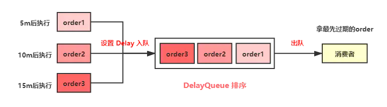
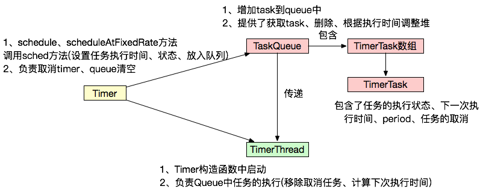
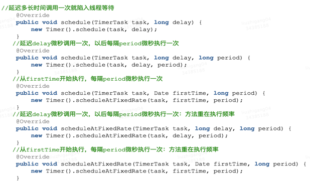
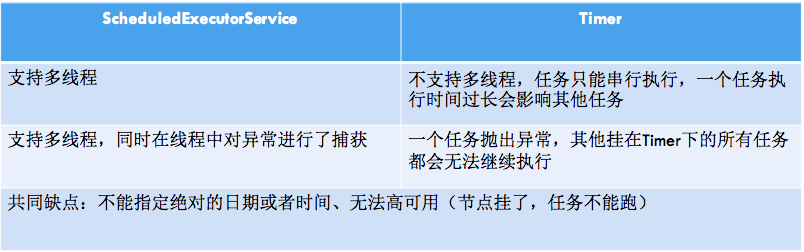
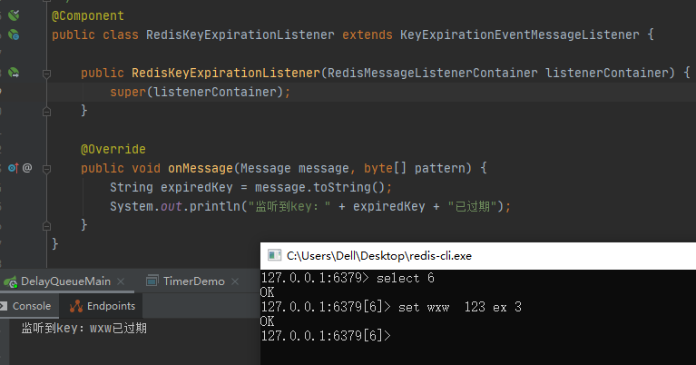

## 如何实现延时队列


### 一、延时队列的应用

#### 1.1 什么是延时队列？

顾名思义：首先它要具有队列的特性，再给它附加一个延迟消费队列消息的功能，也就是说可以指定队列中的消息在哪个时间点被消费。

延时队列在项目中的应用还是比较多的，尤其像电商类平台：

1. 下订单成功后，在30分钟内没有支付，自动取消订单
2. 外卖平台发送订餐通知，下单成功后60s给用户推送短信。
3. 如果订单一直处于某一个未完结状态时，及时处理关单，并退还库存
4. 淘宝新建商户一个月内还没上传商品信息，将冻结商铺等
5. 用户登录之后5分钟给用户做分类推送；
6. 用户多少天未登录给用户做召回推送；
7. 关闭空闲连接。服务器中，有很多客户端的连接，空闲一段时间之后需要关闭之。
8. 清理过期数据业务上。比如缓存中的对象，超过了空闲时间，需要从缓存中移出。
9. 任务超时处理。在网络协议滑动窗口请求应答式交互时，处理超时未响应的请求。
10. 新创建店铺，N天内没有上传商品，系统如何知道该信息，并发送激活短信？

####  1.2 延迟队列和定时任务的区别

- 定时任务有明确的触发时间，延时任务没有
- 定时任务有执行周期，而延时任务在某事件触发后一段时间内执行，没有执行周期
- 定时任务一般执行的是批处理操作是多个任务，而延时任务一般是单个任务

业界目前也有很多实现方案，单机版的方案就不说了，现在也没有哪个公司还是单机版的服务，今天我们一一探讨各种方案的大致实现。

### 二、延时队列的实现

个人一直秉承的观点：工作上能用`JDK`自带`API`实现的功能，就不要轻易自己重复造轮子，或者引入三方中间件。一方面自己封装很容易出问题（大佬除外），再加上调试验证产生许多不必要的工作量；另一方面一旦接入三方的中间件就会让系统复杂度成倍的增加，维护成本也大大的增加。 

#### 2.1 定时轮询（quartz,数据库等）

> 通过一个线程定时的去扫描数据库，通过下订单时间来判断是否有超时的订单，然后进行update或delete等操作

对于未支付的订单，需要进行定期扫描，判断其产生时间有没有超过固定的时间，如果超过则取消订单。这样做很不好，因为：

1. 扫描数据库，每次扫描整个表非常耗时，因为一直在阻塞，很耗费资源
2. 所谓的定期扫描，扫描时间的粒度太小，就会造成资源浪费，扫描的粒度太大就会造成订单没有及时删除

##### **（1）实现** 

> 基于主流的定时任务,定时扫描：

常见的定时任务主要有：quartz、xxl-job、spring系列的task、linux自带的 corntab和加工后的 JcronTab等

下面为方便起见,使用spring task实现主要思路

```java
public class JobDelayQueueDemo {
    
    // 下单时间
    Date submitOrder = null;

    // 取消订单时间：下单30分钟后 检测如果未支付，则自动取消订单，生成订单60s后，给客户发短信
    Date executeTime = null;

    /**
     * Step2: 定时扫描数据库
     *
     * 每隔五秒
     */
    @Scheduled(cron = "0/5 * * * * ? ")
    public void process(){

        System.out.println("我是定时任务！\n 我来看一下延迟时间够了没有！！" );
        /**
         * 检测当前时间 是否是取消订单时间
         * 当前时间 - 执行时间 如果误差小于 2s则取消订单
         */
        if (System.currentTimeMillis() - executeTime.getTime() < 2000) {
            System.out.println("取消订单逻辑处理");
            /**
             * 取消订单逻辑
             * 此处省略1000万行代码
             */
            System.out.println("发送短信提醒客户，订单已取消");
        }

    }

    /**
     * Step1: 提交订单，存入数据库
     */
    public void submitOrder(){
        /**
         * 下单时间，如果当前时间超过下单时间30分钟未支付 则发送短信提醒将自动取消订单
         */
        submitOrder = DateTools.string2DateTime("2020-07-22 13:00:00");

        /**
         *  取消订单时间：下单30分钟后 检测如果未支付，则自动取消订单，生成订单60s后，给客户发短信
         */
        executeTime = DateUtils.addMinutes(submitOrder,30);

        /**
         * 存入数据库
         * 此处省略 100000万行代码
         */
    }
}
```

下面为方便起见,使用spring quartz 实现主要思路:

```java
public class QuartzDelayQueueDemo implements Job {

    // 下单时间
    Date submitOrder = null;

    // 取消订单时间：下单30分钟后 检测如果未支付，则自动取消订单，生成订单60s后，给客户发短信
    Date executeTime = null;

    public static void main(String[] args) throws SchedulerException {
        // 创建任务
        JobDetail jobDetail = JobBuilder.newJob(QuartzDelayQueueDemo.class)
                .withIdentity("job1", "group1").build();
        // 创建触发器 每3秒钟执行一次
        Trigger trigger = TriggerBuilder
                .newTrigger()
                .withIdentity("trigger1", "group3")
                .withSchedule(
                        SimpleScheduleBuilder.simpleSchedule()
                                .withIntervalInSeconds(3).repeatForever())
                .build();
        Scheduler scheduler = new StdSchedulerFactory().getScheduler();
        // 将任务及其触发器放入调度器
        scheduler.scheduleJob(jobDetail, trigger);
        // 调度器开始调度任务
        scheduler.start();

    }

    @Override
    public void execute(JobExecutionContext jobExecutionContext) throws JobExecutionException {
        System.out.println("我是定时任务！\n 我来看一下延迟时间够了没有！！");
        /**
         * 检测当前时间 是否是取消订单时间
         * 当前时间 - 执行时间 如果误差小于 2s则取消订单
         */
        if (System.currentTimeMillis() - executeTime.getTime() < 2000) {
            System.out.println("取消订单逻辑处理");
            /**
             * 取消订单逻辑
             * 此处省略1000万行代码
             */
            System.out.println("发送短信提醒客户，订单已取消");
        }
    }
}
```

**源码地址：** [快速访问](https://github.com/GitHubWxw/wxw-concurrent/tree/master/cloud-delayqueue/src/main/java/com/wxw/common/job_delay_queue) 

##### （2）优缺点

**优点** ：简单易行，支持集群操作
**缺点** ：

- 对服务器内存消耗大
- 存在延迟，比如你每隔3分钟扫描一次，那最坏的延迟时间就是3分钟
- 假设你的订单有几千万条，每隔几分钟这样扫描一次，数据库损耗极大
- 数据量过大时会消耗太多的IO资源，效率太低

#### 2.2 DelayQueue 延时队列（JDK）

`JDK` 中提供了一组实现延迟队列的`API`，位于`Java.util.concurrent`包下`DelayQueue`。

`DelayQueue`是一个`BlockingQueue`（无界阻塞）队列，它本质就是封装了一个`PriorityQueue`（优先队列），`PriorityQueue`内部使用`完全二叉堆`（不知道的自行了解哈）来实现队列元素排序，我们在向`DelayQueue`队列中添加元素时，会给元素一个`Delay`（延迟时间）作为排序条件，队列中最小的元素会优先放在队首。队列中的元素只有到了`Delay`时间才允许从队列中取出。队列中可以放基本数据类型或自定义实体类，在存放基本数据类型时，优先队列中元素默认升序排列，自定义实体类就需要我们根据类属性值比较计算了。

先简单实现一下看看效果，添加三个`order`入队`DelayQueue`，分别设置订单在当前时间的`5秒`、`10秒`、`15秒`后取消。

 

要实现`DelayQueue`延时队列，队中元素要`implements` `Delayed` 接口，这个接口里只有一个`getDelay`方法，用于设置延期时间。`Order`类中`compareTo`方法负责对队列中的元素进行排序。

其中：

- poll()：获取并移除队列的超时元素，没有则返回空 
- take()：获取并移除队列的超时元素，如果没有则wait当前线程，直到有元素满足超时条件，返回结果。

##### **（1）实现** 

1. BlockingQueue+PriorityQueue（堆排序）+Delayed
2. DelayQueue中存放的对象需要实现compareTo()方法和getDelay()方法
3. getDelay方法返回该元素距离失效还剩余的时间，当<=0时元素就失效了，就可以从队列中获取到

```java
public class DelayOrder implements Delayed {

    /**
     * 延迟时间
     */
    @JsonFormat(locale = "zh", timezone = "GMT+8", pattern = "yyyy-MM-dd HH:mm:ss")
    private long time;

    /**
     * 订单号
     */
    String orderNumber = null;

    public DelayOrder(String orderNumber, long time, TimeUnit unit) {
        this.orderNumber = orderNumber;
        this.time = System.currentTimeMillis() + (time > 0 ? unit.toMillis(time) : 0);
    }

    /**
     * 返回距离你自定义的超时时间还有多少
     * @param unit
     * @return
     */
    @Override
    public long getDelay(TimeUnit unit) {
        return time - System.currentTimeMillis();
    }

    /**
     * https://www.runoob.com/java/java-string-compareto.html
     * @param o
     * @return
     */
    @Override
    public int compareTo(Delayed o) {
        DelayOrder Order = (DelayOrder) o;
        long diff = this.time - Order.time;
        if (diff <= 0) {
            return -1;
        } else {
            return 1;
        }
    }

    void print() {
        System.out.println(orderNumber + "编号的订单准备删除，删除时间："
                + DateTools.getLong2YyyyMmDdHhMmSs(System.currentTimeMillis()));
    }

}
```

`DelayQueue`的`put`方法是线程安全的，因为`put`方法内部使用了`ReentrantLock`锁进行线程同步。

 `DelayQueue`还提供了两种出队的方法 `poll()` 和 `take()` 

-  `poll()` 为非阻塞获取，没有到期的元素直接返回null；
-  `take()` 阻塞方式获取，没有到期的元素线程将会等待。

```java
public class DelayQueueDemo {

    public static void main(String[] args) throws InterruptedException {
        DelayOrder orderNumber1 = new DelayOrder("orderNumber1", 5, TimeUnit.SECONDS);
        DelayOrder orderNumber2 = new DelayOrder("orderNumber2", 10, TimeUnit.SECONDS);
        DelayOrder orderNumber3 = new DelayOrder("orderNumber3", 15, TimeUnit.SECONDS);
        DelayQueue<DelayOrder> delayOrders = new DelayQueue<>();
        delayOrders.put(orderNumber1);
        delayOrders.put(orderNumber2);
        delayOrders.put(orderNumber3);
        System.out.println("订单延迟队列开始时间:" + 
                           LocalDateTime.now().format(DateTimeFormatter.ofPattern("yyyy-MM-dd HH:mm:ss")));
        while (delayOrders.size() != 0){
            /**
             * 取队列头部元素是否过去
             * poll()：获取并移除队列的超时元素，没有则返回空
             * take()：获取并移除队列的超时元素，如果没有则wait当前线程，直到有元素满足超时条件，返回结果。
             */
//             DelayOrder task = delayOrders.poll();
            DelayOrder task1 = delayOrders.take();
            if (task1 != null) {
                System.out.format("订单:{%s}被取消, 取消时间:{%s}\n", task1.orderNumber, 
                                  LocalDateTime.now().format(DateTimeFormatter.ofPattern("yyyy-MM-dd HH:mm:ss")));
            }
//            Thread.sleep(1000);
        }
    }
}
```

上边只是简单的实现入队与出队的操作，实际开发中会有专门的线程，负责消息的入队与消费。

执行后看到结果如下，`Order1`、`Order2`、`Order3` 分别在 `5秒`、`10秒`、`15秒`后被执行，至此就用`DelayQueue`实现了延时队列。

```java
订单延迟队列开始时间:2020-12-14 13:20:48
订单:{orderNumber1}被取消, 取消时间:{2020-12-14 13:20:53}
订单:{orderNumber2}被取消, 取消时间:{2020-12-14 13:20:58}
订单:{orderNumber3}被取消, 取消时间:{2020-12-14 13:21:03}
```

##### （2）优缺点

**优点** ：效率高,任务触发时间延迟低

**缺点**：

1. 服务器重启后，数据全部消失，怕宕机
2. 集群扩展相当麻烦
3. 因为内存条件限制的原因，比如下单未付款的订单数太多，那么很容易就出现OOM异常
4. 代码复杂度较高，分布式需要额外实现（无法指定绝对的日期或时间）

#### 2.3 ScheduledExecutorService(JDk 线程池)

**JUC** 提供了相关的类以支持对 **延时任务** 和 **周期任务** 的支持，功能类似于 java.util.Timer，但官方推荐使用功能更为强大全面的 
ScheduledThreadPoolExecutor，因为后者支持多任务作业，即线程池；

##### **（1）实现** 

```java
public void ScheduledExecutorServiceTest() throws InterruptedException {

        ScheduledExecutorService scheduledExecutorService = Executors.newScheduledThreadPool(5);

        System.out.println("创建5秒延迟的任务,时间："+ DateTools.getLong2YyyyMmDdHhMmSs(System.currentTimeMillis()));
        ScheduledFuture<?> schedule = scheduledExecutorService.schedule(() -> doTask("5s"), 5, TimeUnit.SECONDS);

        Thread.sleep(4900);

        schedule.cancel(false);
        System.err.println("取消5秒延迟的任务，时间：" + DateTools.getLong2YyyyMmDdHhMmSs(System.currentTimeMillis()));

        System.out.println("创建3秒延迟的任务，时间" + DateTools.getLong2YyyyMmDdHhMmSs(System.currentTimeMillis()));
        ScheduledFuture<?> schedule2 = scheduledExecutorService.schedule(new Runnable() {
            @Override
            public void run() {
                doTask("3s");
            }
        }, 3, TimeUnit.SECONDS);

        Thread.sleep(4000);

    }
```

执行结果：

```scss
创建5秒延迟的任务,时间：2020-12-14 13:49:17
取消5秒延迟的任务，时间：2020-12-14 13:49:22
创建3秒延迟的任务，时间2020-12-14 13:49:22
3s 任务执行，时间： 2020-12-14 13:49:25
```

#### 2.4 Timer与TimerTask（JDK）

 

- TaskQueue中的排序是对TimerTask中的下一次执行时间进行堆排序，每次去取数组第一个。
- 而delayQueue是对queue中的元素的getDelay()结果进行排序

*Timer是一种定时器工具，用来在一个后台线程计划执行指定任务。它可以计划执行一个任务一次或反复多次。 主要方法：* 

  

##### （1）实现

```java
public class TimerDemo {
    public static void main(String[] args) {
        Timer timer = new Timer();// 实例化Timer类
        timer.schedule(new TimerTask() {
            public void run() {
                System.out.println("退出，时间："+ DateTools.getLong2YyyyMmDdHhMmSs(System.currentTimeMillis()));
                this.cancel();
            }
        }, 5000); // 5s
        System.out.println("本程序存在5秒后自动退出,时间："+ DateTools.getLong2YyyyMmDdHhMmSs(System.currentTimeMillis()));

    }
}
```

##### （2）优缺点

**缺点：** 

- Timers没有持久化机制.
- Timers不灵活 (只可以设置开始时间和重复间隔，不是基于时间、日期、天等（秒、分、时）的)
- Timers 不能利用线程池，一个timer一个线程
- Timers没有真正的管理计划

##### （3）任务对比

 

还有： DelayQueue 延时队列（JDK）,无法指定绝对的日期或时间，无法高可用（节点挂了任务不能跑）

#### 2.5 Redis 延迟队列

Redis 实现延迟队列有两种方式：

1. **Redis sorted set** 
2. **Redis 过期回调** 

##### （1）Redis sorted set

`Redis`的数据结构`Zset`，同样可以实现延迟队列的效果，主要利用它的`score`属性，`redis`通过`score`来为集合中的成员进行从小到大的排序。

 

通过`zadd`命令向队列`delayqueue` 中添加元素，并设置`score`值表示元素过期的时间；

向`delayqueue` 添加三个`order1`、`order2`、`order3`，分别是`10秒`、`20秒`、`30秒`后过期。

```bash
 zadd delayqueue 3 order3
```

消费端轮询队列`delayqueue`， 将元素排序后取最小时间与当前时间比对，如小于当前时间代表已经过期移除`key`。

```java
public class RedisZsetDelayQueue {

    private static String DELAY_QUEUE = "delay_queue";

    public static void main(String[] args) {

        RedisZsetDelayQueue redisDelay = new RedisZsetDelayQueue();
        redisDelay.pushOrderQueue();
        redisDelay.pollOrderQueue();
        redisDelay.deleteZSet();
    }

    /**
     * 消息入队
     */
    public void pushOrderQueue() {
        Jedis jedis = JedisClient.JedisClient();
        Calendar cal1 = Calendar.getInstance();
        cal1.add(Calendar.SECOND, 10);
        int order1 = (int) (cal1.getTimeInMillis() / 1000); // 10s 后的时间戳

        Calendar cal2 = Calendar.getInstance();
        cal2.add(Calendar.SECOND, 20);
        int order2 = (int) (cal2.getTimeInMillis() / 1000);

        Calendar cal3 = Calendar.getInstance();
        cal3.add(Calendar.SECOND, 30);
        int order3 = (int) (cal3.getTimeInMillis() / 1000);

        /**
         * String key, double score, String member
         * key = DELAY_QUEUE
         * order1 = 权重
         * member = order1
         */
        jedis.zadd(DELAY_QUEUE, order1, "order1");
        jedis.zadd(DELAY_QUEUE, order2, "order2");
        jedis.zadd(DELAY_QUEUE, order3, "order3");
        System.out.println(DateTools.getLong2YyyyMmDdHhMmSs(System.currentTimeMillis()) + " add finished.");
    }

    /**
     * 删除队列
     */
    public void deleteZSet() {
        Jedis jedis = JedisClient.JedisClient();
        jedis.del(DELAY_QUEUE);
    }

    /**
     * 消费消息
     */
    public void pollOrderQueue() {

        Jedis jedis = JedisClient.JedisClient();
        while (true) {
            Set<Tuple> set = jedis.zrangeWithScores(DELAY_QUEUE, 0, 0);
            String value = ((Tuple) set.toArray()[0]).getElement();
            int score = (int) ((Tuple) set.toArray()[0]).getScore();

            Calendar cal = Calendar.getInstance();
            int nowSecond = (int) (cal.getTimeInMillis() / 1000);

            if (nowSecond >= score) {
                // 移除有序集合中的一个或多个成员
                jedis.zrem(DELAY_QUEUE, value);
                System.out.println(DateTools.getLong2YyyyMmDdHhMmSs(System.currentTimeMillis()) + 
                                   " removed key:" + value);
            }
            // 获取有序集合的成员数
            if (jedis.zcard(DELAY_QUEUE) <= 0) {
                System.out.println(DateTools.getLong2YyyyMmDdHhMmSs(System.currentTimeMillis()) + " zset empty ");
                return;
            }
            try {
                Thread.sleep(1000);
            } catch (InterruptedException e) {
                e.printStackTrace();
            }
        }
    }
}
```

运行结果：

```scss
2020-12-14 16:49:52 add finished.
2020-12-14 16:50:02 removed key:order1
2020-12-14 16:50:12 removed key:order2
2020-12-14 16:50:22 removed key:order3
2020-12-14 16:50:22 zset empty 
```

##### （2）Redis 的过期回调

`Redis` 的`key`过期回调事件，也能达到延迟队列的效果，简单来说我们开启监听key是否过期的事件，一旦key过期会触发一个callback事件。

修改`redis.conf`文件开启`notify-keyspace-events Ex` 

在线文档：https://redis.io/topics/notifications

```bash
notify-keyspace-events Ex
```

```powershell
############################# Event notification ##############################

# Redis can notify Pub/Sub clients about events happening in the key space.
# This feature is documented at http://redis.io/topics/notifications
#
# For instance if keyspace events notification is enabled, and a client
# performs a DEL operation on key "foo" stored in the Database 0, two
# messages will be published via Pub/Sub:
#
# PUBLISH __keyspace@0__:foo del
# PUBLISH __keyevent@0__:del foo
#
# It is possible to select the events that Redis will notify among a set
# of classes. Every class is identified by a single character:
#  下面是监听时，参数配置：
#  K     Keyspace events, published with __keyspace@<db>__ prefix.
#  E     Keyevent events, published with __keyevent@<db>__ prefix.
#  g     Generic commands (non-type specific) like DEL, EXPIRE, RENAME, ...  基本命令
#  $     String commands
#  l     List commands
#  s     Set commands
#  h     Hash commands
#  z     Sorted set commands
#  x     Expired events (events generated every time a key expires)
#  e     Evicted events (events generated when a key is evicted for maxmemory) 驱逐，赶出 OOM的时候监听
#  A     Alias for g$lshzxe, so that the "AKE" string means all the events.
#
#  The "notify-keyspace-events" takes as argument a string that is composed
#  of zero or multiple characters. The empty string means that notifications
#  are disabled.
#
#  Example: to enable list and generic events, from the point of view of the
#           event name, use:
#
#  notify-keyspace-events Elg
#
#  Example 2: to get the stream of the expired keys subscribing to channel
#             name __keyevent@0__:expired use:
#
#  notify-keyspace-events Ex  ### 参数为 “Ex”。x 代表了过期事件
#
#  By default all notifications are disabled because most users don't need
#  this feature and the feature has some overhead. Note that if you don't
#  specify at least one of K or E, no events will be delivered.
notify-keyspace-events "EX"
```

`Redis`监听配置，注入Bean `RedisMessageListenerContainer` 

```java
@Configuration
public class RedisListenerConfig {
    @Bean
    RedisMessageListenerContainer container(RedisConnectionFactory connectionFactory) {

        RedisMessageListenerContainer container = new RedisMessageListenerContainer();
        container.setConnectionFactory(connectionFactory);
        return container;
    }
}
```

编写Redis过期回调监听方法，必须继承`KeyExpirationEventMessageListener` ，有点类似于MQ的消息监听。

```java
@Component
public class RedisKeyExpirationListener extends KeyExpirationEventMessageListener {
 
    public RedisKeyExpirationListener(RedisMessageListenerContainer listenerContainer) {
        super(listenerContainer);
    }
    @Override
    public void onMessage(Message message, byte[] pattern) {
        String expiredKey = message.toString();
        System.out.println("监听到key：" + expiredKey + "已过期");
    }
}
```

到这代码就编写完成，非常的简单，接下来测试一下效果，在`redis-cli`客户端添加一个`key` 并给定`3s`的过期时间。

```bash
 set wxw 123 ex 3
```

在控制台成功监听到了这个过期的`key`。

```txt
监听到过期的key为：wxw
```

**开启过期事件监听后运行结果：** 

 


相关文章

1. [Redis Zset操作在线文档](https://www.runoob.com/redis/redis-sorted-sets.html) 

#### 2.6 RabbitMQ 延迟队列


**相关文章：** 

1. [六种延迟队列实现方式](https://juejin.cn/post/6844904150703013901)  || [源码](https://github.com/chengxy-nds/Springboot-Notebook) 
2. [延迟任务—队列实现](https://blog.csdn.net/sinat_39336328/article/details/109248534) 
3. [博客园——延迟队列](https://www.cnblogs.com/2019wxw/p/14100139.html) 