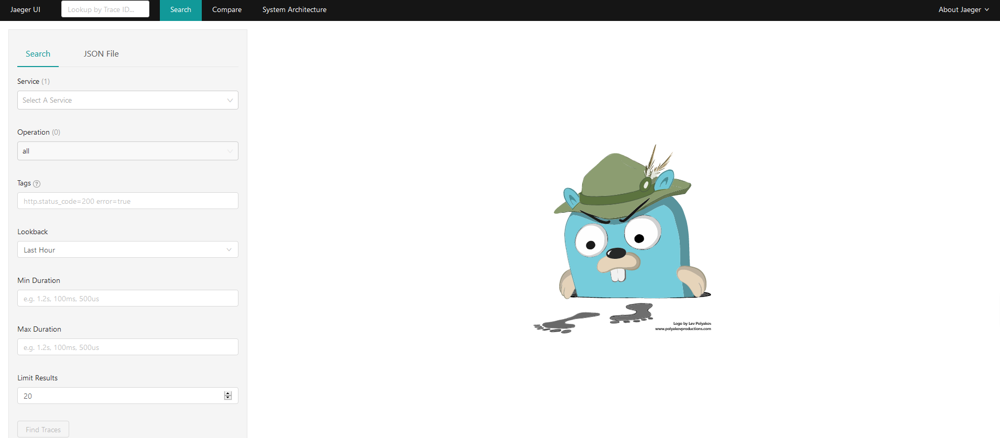

###  分布式全链路追踪


### 1. Jaeger 

#### 1.1 Docker 环境准备

为了方便，使用`docker`来运行`Jaeger`：

```bash
# 拉取jaeger镜像
docker pull jaegertracing/all-in-one:1.17
# 运行jaeger实例，
docker run -d --name jaeger -p 6831:6831/udp -p 16686:16686 jaegertracing/all-in-one:1.17
```

镜像拉下来，在容器中启动并运行。

- 6831是UDP上报jaeger-agent端口
- 16686是Jaeger UI 和 API 端口

#### 1.2 测试环境

- 测试URL：` http://localhost:6830/open` 

- 前端访问地址：http://wxw.plus:16686/search

   


> 案例分析

1. [SpringBoot 整合 OpenTracing 分布式链路追踪系统（Jaeger和Zipkin）](https://blog.csdn.net/dengnanhua/article/details/105330782) 

### 2. ZipKin

#### 2.1 Docker 环境准备

在启动jaeger的同时，启动zipkin:

```bash
# 拉取jaeger镜像
docker pull jaegertracing/all-in-one:1.17
# 运行jaeger实例，
docker run -d --name jaeger \
  -e COLLECTOR_ZIPKIN_HTTP_PORT=9411 \
  -p 6831:6831/udp \
  -p 16686:16686 \
  -p 9411:9411 \
  jaegertracing/all-in-one:1.17
```


